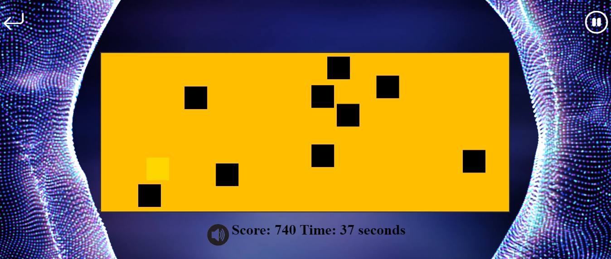
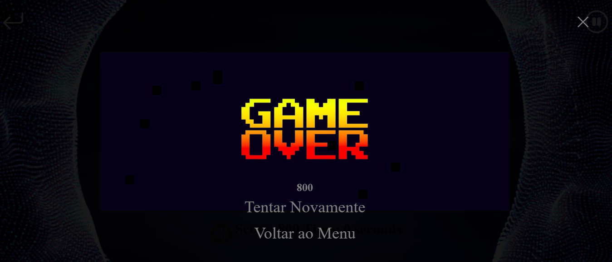

# Click_Square

Click_Square is a simple and fun game developed using HTML, JavaScript, and CSS. The objective of the game is to click on squares that appear on the screen within a set amount of time.

## Table of Contents

- [Getting Started](#getting-started)
- [Prerequisites](#prerequisites)
- [Installation](#installation)
- [Usage](#usage)
- [Contributing](#contributing)
- [Images](#images)
- [License](#license)
## Getting Started

Follow these instructions to get a copy of the game up and running on your local machine for development and testing purposes.

## Prerequisites

To run this game, you only need a web browser (e.g., Chrome, Firefox, Edge) and a code editor if you plan to make changes:


- A modern web browser **(Chrome, Firefox, Safari, Edge)**
- A code editor (optional, for development purposes) like **Visual Studio Code**

## Installation

1. **Clone or download the repository:**
    To clone the repository using Git, run the following command:
    
   ```bash
   git clone https://github.com/Mourinhom6/Click_Square.git

Alternatively, you can download the ZIP file from the repository and extract it to your desired location.

2. **POpen the game files:**

Navigate to the folder where you cloned or extracted the files.

## Usage

1. Open the **index.html** file in your web browser:
- Right-click on the **index.html** file.
- Select "Open with" and choose your preferred web browser.

2. Start clicking the squares as they appear on the screen to score points!

## Contributing
Contributions are welcome! Please fork the repository and create a pull request with your changes.

## Images

 


 

 

## License

[MIT](https://choosealicense.com/licenses/mit/)


